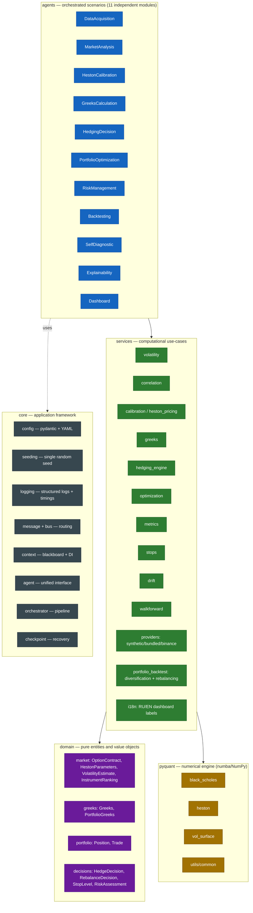
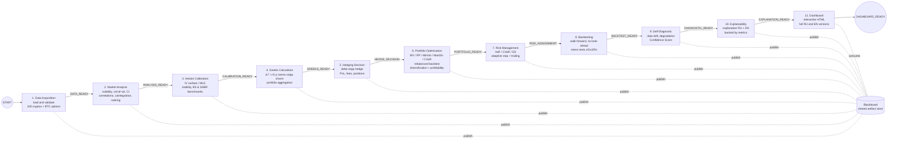
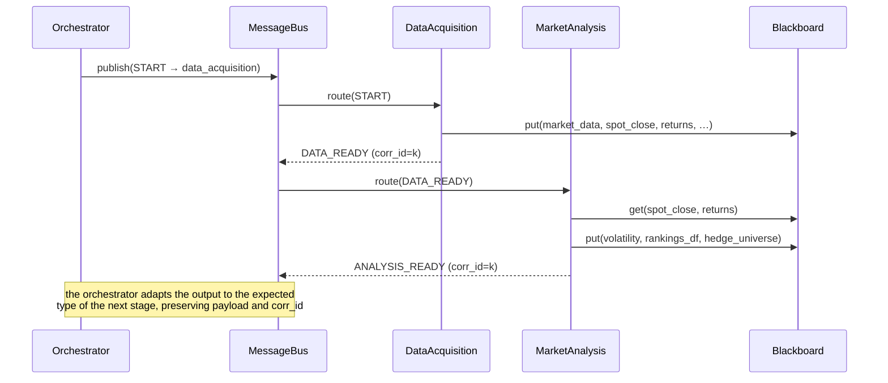

# CryptoHedge System Architecture

> 🇷🇺 Русская версия: **[ARCHITECTURE.md](ARCHITECTURE.md)**.

A multi-agent decision system for hedging currency risk (cryptocurrency
volatility) based on the Heston model.

This document describes: agent roles and responsibilities, the interaction
protocol and message routing, the data and decision flows, and the alignment with
**SOLID** and **Clean Architecture** principles.

---

## 1. Layers (Clean Architecture)

Dependencies point strictly inward: `agents → services → domain`, while the
infrastructure (`core`) provides the contracts that the agents depend on. The
low-level numerical library `pyquant` (numba/NumPy) is the "engine" used by the
`services` layer.

**SOLID alignment:**

- **S** — each agent solves one task; computations live in `services`.
- **O** — new data providers/optimizers are added via factories and the Strategy
  pattern without changing existing code (`build_provider`, `optimize`).
- **L** — all agents are interchangeable thanks to the shared `BaseAgent` contract.
- **I** — narrow interfaces: `MarketDataProvider`, `BaseAgent`, domain value objects.
- **D** — agents depend on abstractions (`AgentContext`, messages), not on each
  other's concrete implementations (Dependency Injection via the context).

---

## 2. Agents: roles, responsibilities, contracts

| # | Agent | Consumes | Produces | Key artifacts (blackboard) | Requirement |
|---|-------|----------|----------|----------------------------|-------------|
| 1 | **DataAcquisition** | `START` | `DATA_READY` | `market_data`, `spot_close`, `spot_bars`, `returns`, `symbols` | 1,2,3 |
| 2 | **MarketAnalysis** | `DATA_READY` | `ANALYSIS_READY` | `volatility`, `hedge_sizing`, `correlation_static`, `rankings_df`, `hedge_universe`, `regime` | 4,5,5.1,5.2 |
| 3 | **HestonCalibration** | `ANALYSIS_READY` | `CALIBRATION_READY` | `calibr_data`, `heston_history`, `heston_stability`, `heston_benchmarks`, `heston_mle` | 7.1,7.2,7.3,12 |
| 4 | **GreeksCalculation** | `CALIBRATION_READY` | `GREEKS_READY` | `portfolio_greeks_latest`, `greeks_timeseries`, `chain_greeks`, `hedge_setup`, `hedge_status` | 6,6.1,6.2 |
| 5 | **HedgingDecision** | `GREEKS_READY` | `HEDGE_DECISION` | `hedge_history`, `hedge_decisions`, `latest_decision` | 7 |
| 6 | **PortfolioOptimization** | `HEDGE_DECISION` | `PORTFOLIO_READY` | `opt_weights`, `optimization_results`, `rebalance_decision`, `portfolio_constituents`, `portfolio_equity`, `portfolio_weights_path`, `portfolio_rebalances`, `diversification`, `method_comparison` | 9,9.1,9.2,9.3,9.4 |
| 7 | **RiskManagement** | `PORTFOLIO_READY` | `RISK_ASSESSMENT` | `risk_assessment`, `stop_level`, `trailing_stops` | 8.1,10,10.1,10.2 |
| 8 | **Backtesting** | `RISK_ASSESSMENT` | `BACKTEST_READY` | `backtest_metrics`, `walkforward`, `stress_table`, `bias_controls` | 8,12,12.1,12.2,12.3 |
| 9 | **SelfDiagnostic** | `BACKTEST_READY` | `DIAGNOSTIC_READY` | `diagnostic`, `confidence_score` | 11,11.1,11.2 |
| 10 | **Explainability** | `DIAGNOSTIC_READY` | `EXPLANATION_READY` | `explanation_text`, `explanation_sections_ru`, `explanation_sections_en` | 14,14.1,14.2,14.3 |
| 11 | **Dashboard** | `EXPLANATION_READY` | `DASHBOARD_READY` | `dashboard_paths` (RU+EN HTML), `dashboard_path` | 13,13.1,13.2 |

Each agent is an independent module (`cryptohedge/agents/*.py`) with a unified
`BaseAgent` interface (`name`, `consumes`, `produces`, `checkpoint_keys`,
`execute`). The `BaseAgent.run` template method uniformly wraps execution:
logging, timing, error capture, checkpointing and recovery.

---

## 3. Data and decision flow (pipeline)

The pipeline is mostly linear, but the interaction is implemented through a
**message bus** and a **blackboard** rather than direct calls between agents:
agents publish artifacts to `AgentContext.blackboard` and exchange typed
`Message` objects through the `MessageBus`.

---

## 4. Interaction protocol and message routing

A `Message` is immutable and contains: `type` (`MessageType`), `sender`,
`recipient`, `payload`, `correlation_id` (links request and response),
`message_id`, `timestamp`.

Routing (`MessageBus`): agents subscribe to message types (`consumes`); on publish
the bus finds the recipients (an explicit `recipient` takes priority over a
subscription) and records every "hop" in the auditable `bus.trace`.

---

## 5. Reproducibility, recovery, logging

- **Single seed.** `core/seeding.set_global_seed` initialises `random`, NumPy,
  `PYTHONHASHSEED` and (optionally) PyTorch. `spawn_rng` yields independent yet
  deterministic sub-streams for individual components.
- **Checkpointing.** `CheckpointManager` saves each agent's artifacts
  (parquet/JSON/pickle) and records completed stages in `manifest.json`. With
  `runtime.resume=true`, already-completed stages are skipped and their results
  restored — the system continues after a failure.
- **Logging.** `StructuredLogger` writes actions, decisions (`DECISION:`), errors
  and operation timings to the console and to JSONL
  (`artifacts/logs/cryptohedge.jsonl`); the `timer` context manager records the
  duration of key operations.
- **Configuration.** All parameters live in `config/*.yaml`, validated in
  immutable pydantic models (`extra="forbid"`), with no hard-coding in the code.

---

## 6. Design patterns

| Pattern | Where | Why |
|---------|-------|-----|
| Blackboard | `AgentContext.blackboard` | shared state without coupling the agents |
| Strategy | `optimization.optimize`, data providers | interchangeable algorithms |
| Factory | `services/providers/build_provider`, `agents.build_pipeline` | configurable assembly |
| Template Method | `BaseAgent.run` | a single agent execution skeleton |
| Dependency Injection | `AgentContext` | injects dependencies into agents |
| Value Object | the `domain` layer | immutable domain entities |
| Publish/Subscribe | `MessageBus` | message routing and tracing |
| Localization (i18n) | `services/i18n.py` | a single label catalogue → full RU and EN dashboard/explanations |

---

## 7. Portfolio management: diversification and profitability

The `PortfolioOptimization` agent builds an **investable portfolio** and confirms
its quality quantitatively:

1. **Universe selection.** Among all assets, the historically profitable
   instruments with the best risk-return profile are selected
   (`portfolio_universe_size`).
2. **Five optimizers.** For each method (MV, Risk Parity, Min Variance, Max
   Diversification, CVaR) target weights are built with a `max_weight` cap
   (concentration control).
3. **Rebalanced backtest.** `portfolio_backtest.backtest_rebalanced` simulates the
   portfolio: between rebalances the weights drift with prices; on rebalancing
   dates they are recomputed from a trailing window, net of fees. The value curve,
   turnover, costs and diversification metrics are computed.
4. **Diversification metrics.** Diversification ratio (DR), effective number of
   assets (inverse HHI), maximum weight, HHI concentration index.
5. **Auto-selection.** Among the **profitable** methods, the best one is chosen by a
   normalised combination of Sharpe and diversification; the choice and its metrics
   feed the dashboard (constituents, value curve with rebalancing, weight evolution
   and method-comparison panels) and the explanation.
