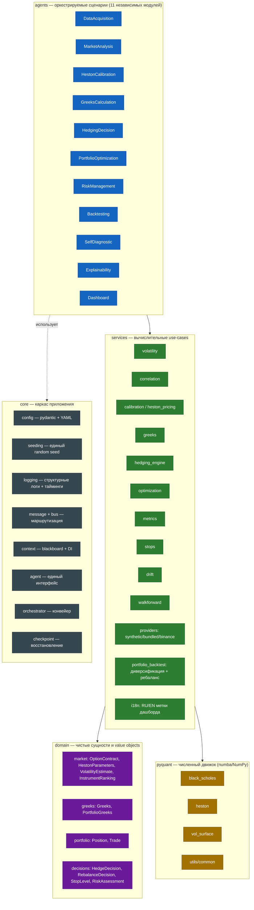
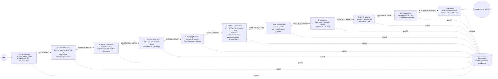
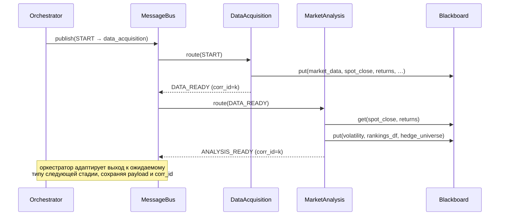

# Архитектура системы CryptoHedge

> 🇬🇧 English version: **[ARCHITECTURE.en.md](ARCHITECTURE.en.md)**.

Мультиагентная система принятия решений для хеджирования валютного риска
(волатильности криптовалют) на базе модели Хестона.

Документ описывает: роли и ответственность агентов, протокол взаимодействия и
маршрутизацию сообщений, потоки данных и принятия решений, а также соответствие
принципам **SOLID** и **Clean Architecture**.

---

## 1. Слои (Clean Architecture)

Зависимости направлены строго внутрь: `agents → services → domain`, а
инфраструктура (`core`) предоставляет контракты, от которых зависят агенты.
Низкоуровневая численная библиотека `pyquant` (numba/NumPy) — это «движок»,
используемый слоем `services`.

**Соответствие SOLID:**

- **S** — каждый агент решает одну задачу; вычисления вынесены в `services`.
- **O** — новые провайдеры данных/оптимизаторы добавляются через фабрики и
  Strategy-паттерн без изменения существующего кода (`build_provider`, `optimize`).
- **L** — все агенты взаимозаменяемы за счёт общего контракта `BaseAgent`.
- **I** — узкие интерфейсы: `MarketDataProvider`, `BaseAgent`, value-objects домена.
- **D** — агенты зависят от абстракций (`AgentContext`, сообщения), а не от
  конкретных реализаций друг друга (Dependency Injection через контекст).

---

## 2. Агенты: роли, ответственность, контракты

| # | Агент | Потребляет | Производит | Ключевые артефакты (blackboard) | Требование |
|---|-------|-----------|------------|----------------------------------|------------|
| 1 | **DataAcquisition** | `START` | `DATA_READY` | `market_data`, `spot_close`, `spot_bars`, `returns`, `symbols` | 1,2,3 |
| 2 | **MarketAnalysis** | `DATA_READY` | `ANALYSIS_READY` | `volatility`, `hedge_sizing`, `correlation_static`, `rankings_df`, `hedge_universe`, `regime` | 4,5,5.1,5.2 |
| 3 | **HestonCalibration** | `ANALYSIS_READY` | `CALIBRATION_READY` | `calibr_data`, `heston_history`, `heston_stability`, `heston_benchmarks`, `heston_mle` | 7.1,7.2,7.3,12 |
| 4 | **GreeksCalculation** | `CALIBRATION_READY` | `GREEKS_READY` | `portfolio_greeks_latest`, `greeks_timeseries`, `chain_greeks`, `hedge_setup`, `hedge_status` | 6,6.1,6.2 |
| 5 | **HedgingDecision** | `GREEKS_READY` | `HEDGE_DECISION` | `hedge_history`, `hedge_decisions`, `latest_decision` | 7 |
| 6 | **PortfolioOptimization** | `HEDGE_DECISION` | `PORTFOLIO_READY` | `opt_weights`, `optimization_results`, `rebalance_decision`, `portfolio_constituents`, `portfolio_equity`, `portfolio_weights_path`, `portfolio_rebalances`, `diversification`, `method_comparison` | 9,9.1,9.2,9.3,9.4 |
| 7 | **RiskManagement** | `PORTFOLIO_READY` | `RISK_ASSESSMENT` | `risk_assessment`, `stop_level`, `trailing_stops` | 8.1,10,10.1,10.2 |
| 8 | **Backtesting** | `RISK_ASSESSMENT` | `BACKTEST_READY` | `backtest_metrics`, `walkforward`, `stress_table`, `bias_controls` | 8,12,12.1,12.2,12.3 |
| 9 | **SelfDiagnostic** | `BACKTEST_READY` | `DIAGNOSTIC_READY` | `diagnostic`, `confidence_score` | 11,11.1,11.2 |
| 10 | **Explainability** | `DIAGNOSTIC_READY` | `EXPLANATION_READY` | `explanation_text`, `explanation_sections_ru`, `explanation_sections_en` | 14,14.1,14.2,14.3 |
| 11 | **Dashboard** | `EXPLANATION_READY` | `DASHBOARD_READY` | `dashboard_paths` (RU+EN HTML), `dashboard_path` | 13,13.1,13.2 |

Каждый агент — независимый модуль (`cryptohedge/agents/*.py`) с единым интерфейсом
`BaseAgent` (`name`, `consumes`, `produces`, `checkpoint_keys`, `execute`). Шаблонный
метод `BaseAgent.run` единообразно оборачивает выполнение: логирование, замер
времени, перехват ошибок, чекпойнтинг и восстановление.

---

## 3. Поток данных и принятия решений (конвейер)

Конвейер преимущественно линейный, но взаимодействие реализовано через
**шину сообщений** и **доску (blackboard)**, а не прямые вызовы между агентами:
агенты публикуют артефакты в `AgentContext.blackboard` и обмениваются
типизированными сообщениями `Message` через `MessageBus`.

---

## 4. Протокол взаимодействия и маршрутизация сообщений

Сообщение `Message` неизменяемо и содержит: `type` (`MessageType`), `sender`,
`recipient`, `payload`, `correlation_id` (связывает запрос и ответ),
`message_id`, `timestamp`.

Маршрутизация (`MessageBus`): агенты подписываются на типы сообщений
(`consumes`); при публикации шина находит получателей (явный `recipient`
приоритетнее подписки) и фиксирует каждый «хоп» в аудируемом трейсе `bus.trace`.

---

## 5. Воспроизводимость, восстановление, логирование

- **Единый seed.** `core/seeding.set_global_seed` инициализирует `random`,
  NumPy, `PYTHONHASHSEED` и (опционально) PyTorch. `spawn_rng` даёт независимые,
  но детерминированные суб-потоки для отдельных компонентов.
- **Checkpointing.** `CheckpointManager` сохраняет артефакты каждого агента
  (parquet/JSON/pickle) и отмечает завершённые стадии в `manifest.json`. При
  `runtime.resume=true` уже выполненные стадии пропускаются, а их результаты
  восстанавливаются — система продолжает работу после сбоя.
- **Логирование.** `StructuredLogger` пишет действия, решения (`DECISION:`),
  ошибки и время выполнения операций в консоль и в JSONL
  (`artifacts/logs/cryptohedge.jsonl`); контекст-менеджер `timer` фиксирует
  длительность ключевых операций.
- **Конфигурация.** Все параметры — в `config/*.yaml`, валидируются в
  immutable pydantic-моделях (`extra="forbid"`), никакого хардкода в коде.

---

## 6. Паттерны проектирования

| Паттерн | Где | Зачем |
|---------|-----|-------|
| Blackboard | `AgentContext.blackboard` | разделяемое состояние без связности агентов |
| Strategy | `optimization.optimize`, провайдеры данных | взаимозаменяемые алгоритмы |
| Factory | `services/providers/build_provider`, `agents.build_pipeline` | конфигурируемая сборка |
| Template Method | `BaseAgent.run` | единый каркас исполнения агента |
| Dependency Injection | `AgentContext` | подача зависимостей в агенты |
| Value Object | слой `domain` | неизменяемые предметные сущности |
| Publish/Subscribe | `MessageBus` | маршрутизация и трассировка сообщений |
| Localization (i18n) | `services/i18n.py` | единый каталог меток → полные RU и EN версии дашборда/объяснений |

---

## 7. Управление портфелем: диверсификация и прибыльность

Агент `PortfolioOptimization` формирует **инвестиционный портфель** и подтверждает
его качество количественно:

1. **Отбор вселенной.** Из всех активов выбираются исторически прибыльные
   инструменты с лучшим риск-доходным профилем (`portfolio_universe_size`).
2. **Пять оптимизаторов.** Для каждого метода (MV, Risk Parity, Min Variance,
   Max Diversification, CVaR) строятся целевые веса с ограничением `max_weight`
   (контроль концентрации).
3. **Бэктест с ребалансировкой.** `portfolio_backtest.backtest_rebalanced`
   симулирует портфель: между ребалансировками веса дрейфуют с ценами, в даты
   ребаланса пересчитываются по скользящему окну с учётом комиссий. Считается
   кривая стоимости, оборот, издержки и метрики диверсификации.
4. **Метрики диверсификации.** Коэффициент диверсификации (DR), эффективное число
   активов (обратный HHI), максимальный вес, индекс концентрации HHI.
5. **Авто-выбор метода.** По нормированной комбинации Sharpe и диверсификации
   среди **прибыльных** методов выбирается лучший; выбор и метрики попадают в
   дашборд (панели состава, кривой стоимости с ребалансировкой, эволюции весов и
   сравнения методов) и в объяснение.
